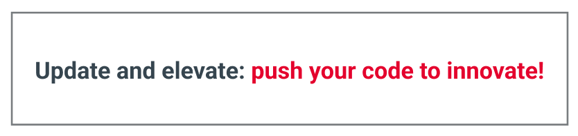

# Get started



## 1. Install Node.Js

- Download and install [Node.Js](https://nodejs.org/en)
- Verify Node.Js Installation, npm and npx

```bash
node --version
v20.12.2

npm --version
10.5.0

npx --version
10.5.0
```

## 2. Install Visual Studio Code

- [Download vscode](https://code.visualstudio.com/download)

## 3. Create new expo project using `npx` command

- Start vscode
- Open Terminal **Ctrl+`**
- run the following command

this will create a new expo project and give you the option to select the template

```bash
npx create-expo-app@latest --template
```


Select **Blank**


Enter the project name: `roi-mobile-<Student initials>`


The last output when installation completed


## 4. Open the project using Vscode

Change directory

```bash
cd roi-mobile-jh
```

Open vscode using the command

```bash
code .
```

You should find the following files in the explorer pan


## 5. Install Packages

Install the following 13 packages using the following commands:

```bash
npx expo install react-native-web react-dom @expo/metro-runtime
```

```bash
npx expo install @expo/vector-icons
```

```bash
npx expo install @react-navigation/native
```

```bash
npx expo install @react-navigation/native-stack
```

```bash
npx expo install @react-navigation/bottom-tabs
```

```bash
npx expo install @react-native-async-storage/async-storage
```

```bash
npx expo install @react-native-community/netinfo
```

```bash
npx expo install @react-native-picker/picker
```

```bash
npx expo install expo-linking
```

```bash
npx expo install moment
```

```bash
npx expo install react-native-flash-message
```

## 6. Install Extensions

Expo Tools


ES7 React/Redux/GraphQL/React-Native snippet


ES7+ React/Redux/React-Native snippets


React Native Tools


Simple React Snippets


VSCode React Refactor


ESLint


Prettier - Code formatter


Expo Theme


GitHub Pull Requests


## 7. Template Implementation

- Download and extract zip file [roi-mobile-2024.zip](/Documents/roi-mobile-2024.zip)
- Copy and overnight into the project folder
- Run the app `npm run web`

