# Using Git

- **Set a Username**: `git config --gLobal user.name "<firstname Lastname>"`
- **Set an Email address**: `git config --gLobal user.email "<valid-email>"`
- **Create a Branch**: Use the command `git branch <branch-name>` to create a new branch.
- **Switch to the Branch**: Change to your new branch with `git checkout <branch-name>`
- **Stage Changes**: Add your changes to the staging area with `git add .` to include all changes, or `git add <file-name>` for specific files.
- **Commit Changes**: Commit your staged changes with `git commit -m "Your commit message"`
- **Push to Remote**: Finally, push your branch to the remote repository using `git push origin <branch-name>`
- **Display the global configuration**: `git config --global --list`
- **Initialize as a Git repository**: `git init`
- **Show modified files in working directory**: `git status`
- **Display the commit history**: `git log`
- **Add all changed files to staging area**: `git add .`
- **Commit your staged content as a new commit snapshot**: `git commit -m "<descriptive message>"`
- **To check which branch that is**: `git branch`

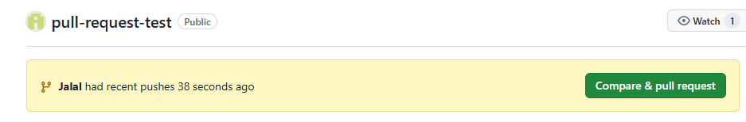

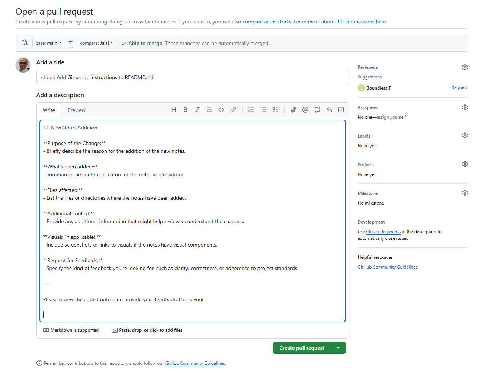

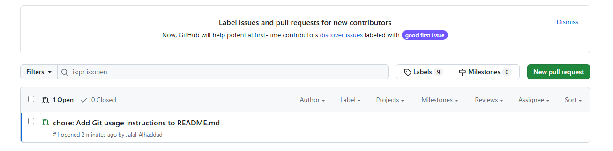

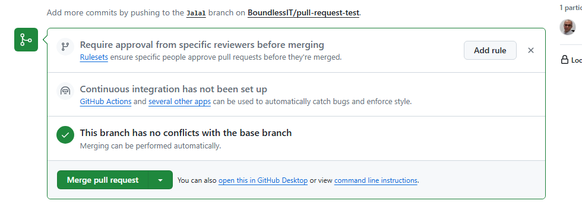

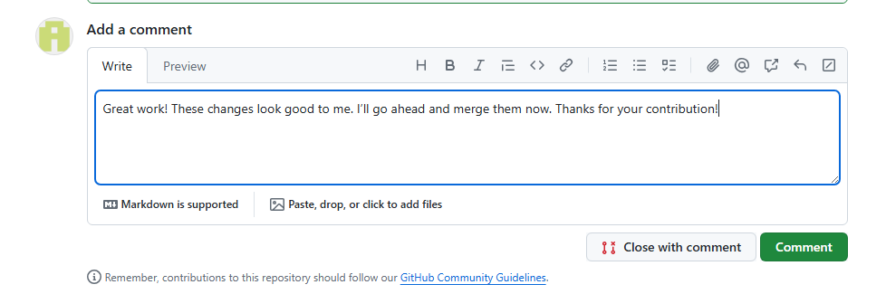

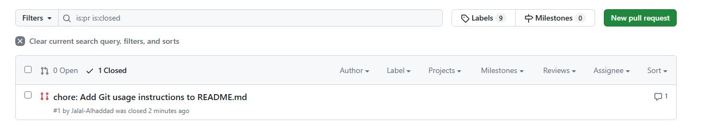

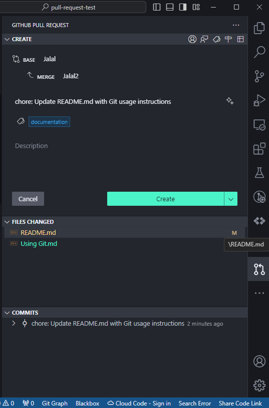

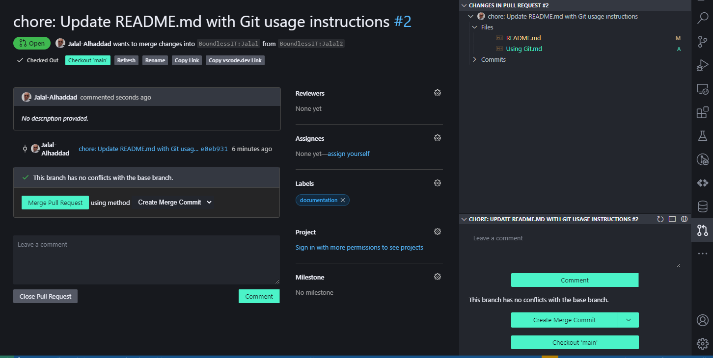

maintainer

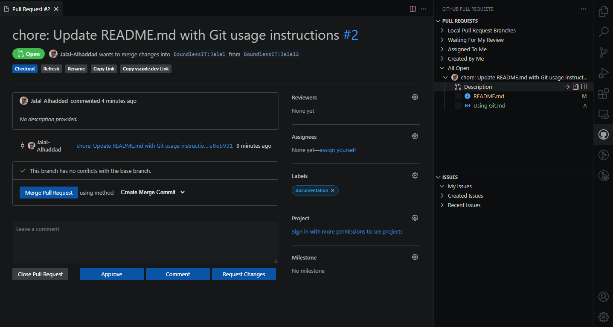

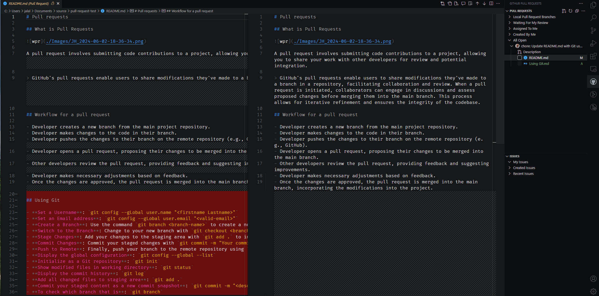

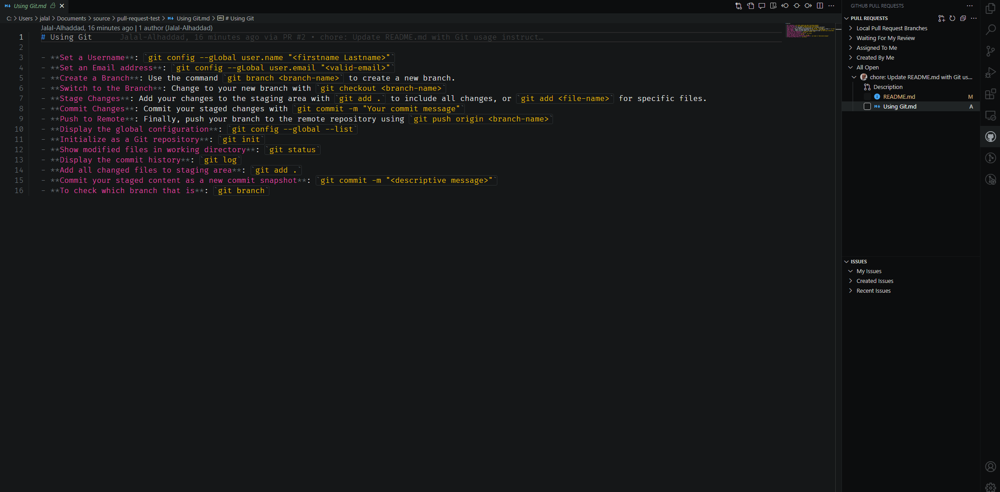

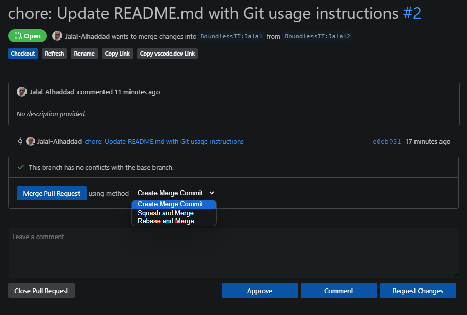
