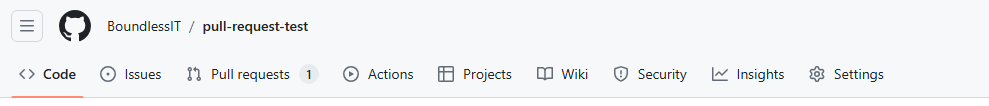
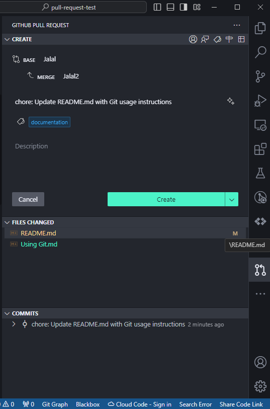
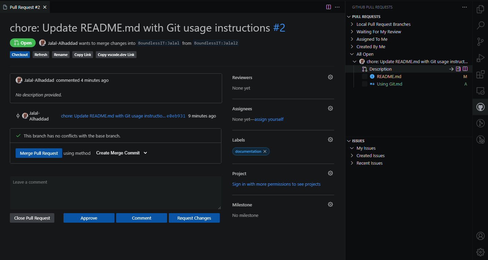
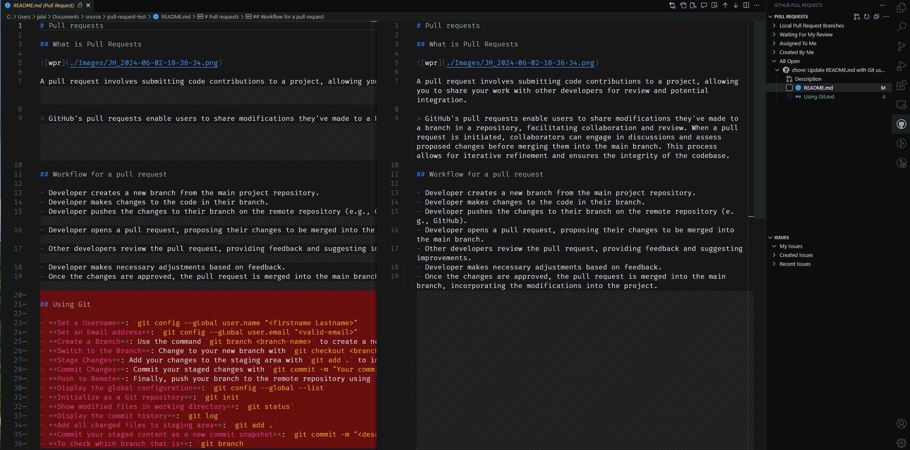
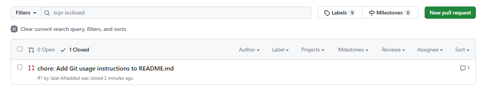

# Pull requests

## What is Pull Requests


A pull request involves submitting code contributions to a project, allowing you to share your work with other developers for review and potential integration.

> GitHub's pull requests enable users to share modifications they've made to a branch in a repository, facilitating collaboration and review. When a pull request is initiated, collaborators can engage in discussions and assess proposed changes before merging them into the main branch. This process allows for iterative refinement and ensures the integrity of the codebase.

## Workflow for a pull request

- Developer creates a new branch from the main project repository.
- Developer makes changes to the code in their branch.
- Developer pushes the changes to their branch on the remote repository (e.g., GitHub).
- Developer opens a pull request, proposing their changes to be merged into the main branch.
- Other developers review the pull request, providing feedback and suggesting improvements.
- Developer makes necessary adjustments based on feedback.
- Once the changes are approved, the pull request is merged into the main branch, incorporating the modifications into the project.

## Maintainer side

### 1. Install extensions

Install the **GitHub Repositories** and **Pull Requests extensions** if you haven’t already

> You must login to github for both extensions

### 2. Create new repository

- Create and open new Folder in Visual Studio Code
- Add `Readme.md` file
- Open the Command Palette (`Ctrl+Shift+P` or `Cmd+Shift+P` on Mac).
- initialize repository using `Git: Initialize Repository`
- Or switch to source control and press button `Initialize Repository`

- Create the repository using `Publish to GitHub`
- Select public or private repository

### 3. Inviting as a collaborator

To allow another developer to participate in your GitHub repository, create branches, and send pull requests, you can add them as a collaborator to your repository. Here’s how you can do it:

- **Ask for the username** of the person you’re inviting as a collaborator.
- **Navigate to your repository** on GitHub.com.
- **Click on the ‘Settings**’ tab of your repository.
- In the sidebar, **click on ‘Collaborators & teams’**.
- **Click on ‘Add people’** or ‘Invite a collaborator’.
- **Enter the username** or **email address** of the person you want to invite in the search field.
- **Select the user** from the list of matches.
- **Choose a role** for the collaborator (e.g., Write, Read, Admin).
- Click on ‘Add `[username]` to `[repository]`.

The invited user will receive an email with the invitation to join your repository as a collaborator. Once they accept the invitation, they will be able to create branches and submit pull requests to your repository.

Remember, collaborators on a personal repository can work on the repository based on the permissions you grant them. If you need more granular access control, consider creating an organization and managing access through teams.

## Contributor side

### 1. Extensions

Install the **GitHub Repositories** and **Pull Requests extensions** if you haven’t already

> You must login to github for both extensions

### 1. Clone a repo

- Clone the repository to your local machine using the `git clone` command.
- **Create a New Branch**: Create a new branch for your changes with `git checkout -b new-branch-name`
- **Make Your Changes**: Work on the changes you’d like to propose to the original repository.
- **Commit the Changes**: Use `git add` to stage your changes and git commit to commit them with a descriptive message.
- **Push the Branch**: Push the branch with your changes to GitHub using `git push origin new-branch-name`.

### 3. Create the pull request from github.com site

- Go to the original repository on GitHub.
- You’ll see a “Compare & pull request” button for your branch if it’s recently pushed. Click it.
  
- If you don’t see the button, navigate to the “Pull requests” tab and click the “New pull request” button.
- Choose your branch and the branch you want to merge the changes into.
  
- Fill in the title and description for your pull request.
- Click “Create pull request”
  
- Click on Pull requests tab
- Start communicate with other
  

### 4. Creating the pull request from Visual Studio Code









## Pull request message template

When adding new notes to a pull request, it’s important to communicate effectively with your team. Here’s a template you can use for your pull request message:

```javascript
## New Notes Addition

**Purpose of the Change:**
- Briefly describe the reason for the addition of the new notes.

**What's been added:**
- Summarize the content or nature of the notes you're adding.

**Files affected:**
- List the files or directories where the notes have been added.

**Additional context:**
- Provide any additional information that might help reviewers understand the changes.

**Visuals (if applicable):**
- Include screenshots or links to visuals if the notes have visual components.

**Request for Feedback:**
- Specify the kind of feedback you're looking for, such as clarity, correctness, or adherence to project standards.

Please review the added notes and provide your feedback. Thank you!
```

## Maintainer response

If the main owner of the repository finds that the changes proposed in your pull request are satisfactory and ready to be merged, they will typically respond with a comment indicating their approval. They might say something like:

“**Great work! These changes look good to me. I’ll go ahead and merge them now. Thanks for your contribution!**”

After this, the repository owner or a maintainer with the necessary permissions will merge the pull request. They can do this by clicking the Merge pull request button on the pull request page on GitHub. There are a few merge options available:

- **Merge Commit**: Combines all of your commits into a new commit in the main branch.
- **Squash and Merge**: Squashes all your commits into a single commit before merging.
- **Rebase and Merge**: Adds your commits onto the main branch individually without a merge commit.

Once the pull request is merged, GitHub will automatically mark it as closed. However, if you want to manually close a pull request without merging, you can do so by clicking the Close pull request button at the bottom of the pull request page1.

Additionally, after the pull request is merged, it’s a good practice to delete the feature branch to **keep the repository tidy**. GitHub provides an option to **Delete branch** right after the merge is completed. This helps maintain a clean list of branches in the repository.

## Browse old closed pull requests

To browse old closed pull requests on GitHub, you can follow these steps:



- **Go to the GitHub repository** where the pull request was made.
- **Click on the “Pull Requests”** tab near the top of the repository page.
- Above the list of pull requests, you will see a filter bar. **Change the filter parameter** from 'is:pr is:open' to `is:pr is:closed`
- This will display all the closed pull requests for that repository.

You can also use the search bar in the “Pull Requests” tab to find closed pull requests by specific criteria, such as the author’s username, date, and more1.

This will show you a list of all the pull requests you’ve created that are now closed2. Remember to replace username with your actual GitHub username.

## Fetching contributors’ branches

If **maintainer** synced repository in VS Code but can’t see the other contributors’ branches, it may need to fetch the branches from the remote repository. Here’s how you can do it:

- Open the **Command Palette** in VS Code with `Ctrl+Shift+P` (or `Cmd+Shift+P` on Mac).
- Type `Git: Fetch` and select it. This will fetch all the branches from the remote repository, including those that you don’t have locally.
- To see the list of branches, go to the Source Control panel, and click on the branches icon or the **current branch name at the bottom left of the VS Code window**.
- You should now see a list of all branches, including remote branches. If you want to check out a remote branch, you can click on it and select 'Checkout to…'

If you’re still having trouble seeing the branches after fetching, make sure that your local git configuration is set up correctly and that you have the necessary permissions to access the branches on the remote repository. If the issue persists, you might want to check the output of the `Git: Show Git Output` command from the Command Palette for any errors or clues as to what might be going wrong.

## Links

[About pull requests](https://docs.github.com/en/pull-requests/collaborating-with-pull-requests/proposing-changes-to-your-work-with-pull-requests/about-pull-requests)

[Pull Requests in VS Code (Youtube)](https://www.youtube.com/watch?v=LdSwWxVzUpo&t=161s)
